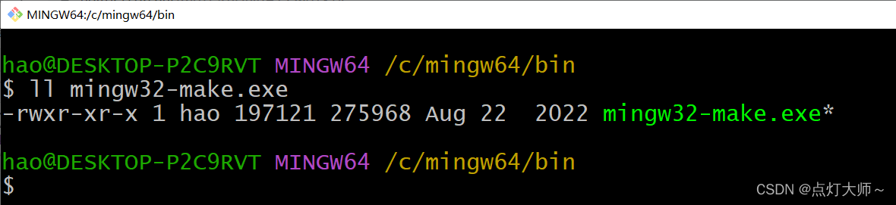
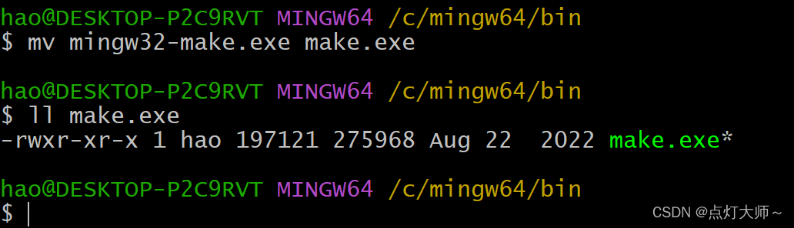

# 一、环境篇

### 1、 GNU Arm Embedded Toolchain

进到[ARM官网](https://developer.arm.com/tools-and-software/open-source-software/developer-tools/gnu-toolchain/gnu-rm/downloads)选择win32版本下载

下载好之后，解压到C盘根目录下(`建议`)，打开文件，找到 **/bin** 目录


添加到环境中，接着Win+R输入 **powershell**，然后输出 **arm-** 按下Tab键后，若补全则代表环境配置成功

### 2、Mingw-w64

>Mingw-w64也就是gcc，若电脑已经配置过，跳到下一步

方法一：
官网下载路径：[https://www.mingw-w64.org/](https://www.mingw-w64.org/)

方法二：
链接：[https://pan.baidu.com/s/1I_HU6eTi-Yv3LvRnajjsLA](https://pan.baidu.com/s/1I_HU6eTi-Yv3LvRnajjsLA )
提取码：4e20

解压到C盘，找到 **/bin** 目录，然后添加到系统环境变量中

打开cmd查看一下版本信息: **gcc -v**


### 3、安装Make

在Windows上安装make有两种方法。

#### 方法一

其实在我们安装的Mingw-w64的bin目录下就有编译好的**make**，只不过名字不叫做make，而叫做 **mingw32-make.exe**


我们可以将这个.exe文件重命名为我们熟悉的make：



重命名时不要忘记后缀.exe。重命名之后我们就可以使用make了。

#### 方法二

在windows上安装make我们可以借助[Chocolatey
](https://chocolatey.org/install)

首先在开始页面找到poweshell，右键选择以管理员身份运行


运行以下命令：

```bash
Set-ExecutionPolicy Bypass -Scope Process -Force; [System.Net.ServicePointManager]::SecurityProtocol = [System.Net.ServicePointManager]::SecurityProtocol -bor 3072; iex ((New-Object System.Net.WebClient).DownloadString('https://community.chocolatey.org/install.ps1'))
```
将复制的文本粘贴到 shell 中，然后按 Enter 键，等待几秒钟

如果您没有看到任何错误，则表示您已下载好 **Chocolatey**

紧接着下载make，在shell中输入以下命令：

```bash
choco install make
```

等待完成~

### 4、 安装openocd

下载路径：[https://github.com/xpack-dev-tools/openocd-xpack/releases](https://github.com/xpack-dev-tools/openocd-xpack/releases)

下载好之后，解压到C盘根目录下并重命名文件为openocd(`建议`)，然后打开文件，找到 **/bin** 目录，添加到环境变量中

打开cmd查看一下版本信息: **openocd -v**


# 二、软件篇

>此时环境已经配置完成，下面就是本篇文章的重头戏了

### 1、安装STM32CubeMx

电脑上若有此软件，直接看下面内容，若没有安装，可以参考我的这篇文章：[STM32LL库系列教程【一】——安装CubeMx软件](https://blog.csdn.net/m0_47329175/article/details/121189421)

我们打开CubeMx，我们将PB0配置成输出模式，接着配置工程属性
我们在配置 Toolchain/IDE 时选择Makefile

> 注意：CubeMx版本最好大于 4.0


###  2、安装VSCode

下载路径：[https://code.visualstudio.com/](https://code.visualstudio.com/)

选择windows版下载，安装

#### 安装插件


### 3、编译工程

用VSCode打开刚才生成工程文件，新建一个终端，输入make启动编译


### 4、下载程序

找到刚才解压到C盘目录下的**openocd**

在此目录下：**\openocd\scripts\interface** 存放的是**接口配置文件**
在此目录下： **\openocd\scripts\target** 存放的是**目标芯片配置文件**

openOCD连接目标芯片的命令格式为：

```bash
openocd -f <接口配置文件> -f <目标芯片配置文件>
```

连接好之后我们往目标芯片下载程序，此时会用到 **-c** 参数

我们按照下面三个步骤即可下载程序：

1、目标芯片挂起：**-c init -c halt**
2、烧写：-c "flash write_image erase xxx.hex"
3、复位:   **-c reset -c halt -c shutdown**

综上，下载程序需要执行以下命令：

```bash
openocd -f <接口配置文件> -f <目标芯片配置文件> -c init -c halt -c "flash write_image erase xxx.hex" -c reset -c halt -c shutdown
```

我们打开CubeMx生成的 **Makefile**，在最后面添加以下内容：

```bash
download:
	openocd -f C:/openocd/scripts/interface/cmsis-dap.cfg -f C:/openocd/scripts/target/stm32f1x.cfg  -c init -c halt -c "flash write_image erase ./build/$(TARGET).hex" -c reset -c halt -c shutdown
```


我使用的开发板是**STM32F103ZET6**的，下载器是野火的**DAP**，若是其他的，自行更改

现在我们在终端中运行命令：

```bash
make download
```

即可下载程序

### 5、Debug

我们借助插件：**Cortex-Debug**可以对STM32在线调试

按照下图所示步骤依次点击

默认的调试借助的是JLink，我们改为通过openocd使用野火的DAP仿真器来进行调试

首先先将JLink调试删除，只删除最里面的花括号，然后点击右下角的**添加配置**，接着选择 **openocd**，配置方法可以按照我的来更改，保存之后，按下 **F5** 就可以进行调试了


### 6、配置C/C++

在我们打开main.c文件时，会看到好多红色波浪线，发生这个原因是我们没有配置C/C++这个插件

按下Ctrl+Shift+P输入编辑配置，选择 **UI** 点进去


我们需要配置以下内容：


此时发现还是有红色波浪线，证明我们还没有配置结束

在用keil时我们知道需要添加一个全局宏定义，我们在这里也需要，首先打开Makefile，找到宏定义处，如下图：


我们将**USE_HAL_DRIVER，STM32F103xx**添加到C/C++插件配置中


这样就完成C/C++插件的配置了，现在红色波浪线也消失不见了，我们就可愉快的敲代码了

### 7、一键编译、下载

若是每次编译与下载都需要在终端中输入命令就显得笨重了，好在VSCode有一个任务task,我们可以借助task来实现一键编译、下载

按下**Ctrl+Shift+P**输入 **task --> 配置任务 --> 使用模板创建task.json文件 --> other**

会进到 **task.json** 文件中，然后我们更改task.json文件，可以参考我的

```javascript
{
        // See https://go.microsoft.com/fwlink/?LinkId=733558
        // for the documentation about the tasks.json format
        "version": "2.0.0",
        "tasks": [
            {
                "label": "build",
                "type": "shell",
                "options": {
                    "cwd": "${workspaceRoot}"
                },
                "command": "make",
                "group": {
                    "kind": "build",
                    "isDefault": true
                },
                "problemMatcher": []
            },
            {
                "label": "Download",
                "type": "shell",
                "options": {
                    "cwd": "${workspaceRoot}"
                },
                "command": "make download",
                "group": {
                    "kind": "build",
                    "isDefault": true
                }
            }
        ]
    }
    
```

按下 **Ctrl+Shift+B** 就可以一键编译、下载了

### 8、更改键盘快捷键

我们在Keil下可以使用 **F7** 键直接一键编译，我们在VSCode里面也可以设置成一键编译

只需要根据以下步骤设置即可：

 1. 按下 **Ctrl+Shift+p** 输入 **key**
 2. 首选项：打开键盘快捷方式

 3.接着输入 **Ctrl b** 将鼠标放到运行生成任务左边，可以进行更改
 
4.按下你想更改的键


ok，至此完美收工
