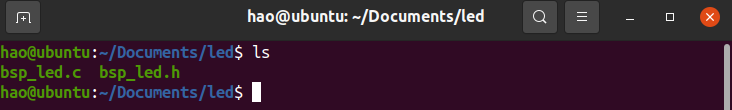

# STM32_Template

#### 介绍
基于GCC的工程模板

#### 目录介绍
- build：编译之后生成的文件
- Doc：说明文档
- Hardware：模块驱动
- Libraries：STM32官方库
- User：用户编写

#### 使用说明
 **1、更改Makefile** 

使用 VSCode 打开此工程之后，根据以下说明操作即可使用：

1.1、在 Makefile 文件中，更改一下你的Openocd路径

1.2、查看一下启动文件(.s)与全局宏定义是否不符

1.3、查看一下当前选择的flash大小是否与你的一致

1.4、看一下Makefile中的汉字注释

经过上面四个步骤即可使用

 **2、编译、下载** 
按下按键 Ctrl+Shift+b 会出现三个选项：build、Download、clean

- build： 编译工程
- Download： 下载到开发板
- clean： 清楚编译生成的文件

 **3、添加外设驱动** 
外设初始化、模块等源码放到 Hardware 目录下，打开Makefile文件，添加文件路径

### 工程演示

**示例：在工程中添加LED小灯**

  1. 首先我们看下LED文件夹中的内容
    
  2. 将此文件夹移动/复制到此工程模板的**Hardware**目录下 
    
  3. 用VSCode打开此工程
  4. 打开**Makefile**文件，在以下地方添加编译路径开发区编译对象
    
  5. 由于LED文件夹我们放到了**Hardware**目录下 ，所以我们只需在“USER_INC”添加即可
   
  6. 至此就可以编写、编译、下载了

>说明：上述示例中，第4步中的SYS_DIR、SYS_SOURCE是我定义好的
>
>这个符号 *$* 表示使用某个变量